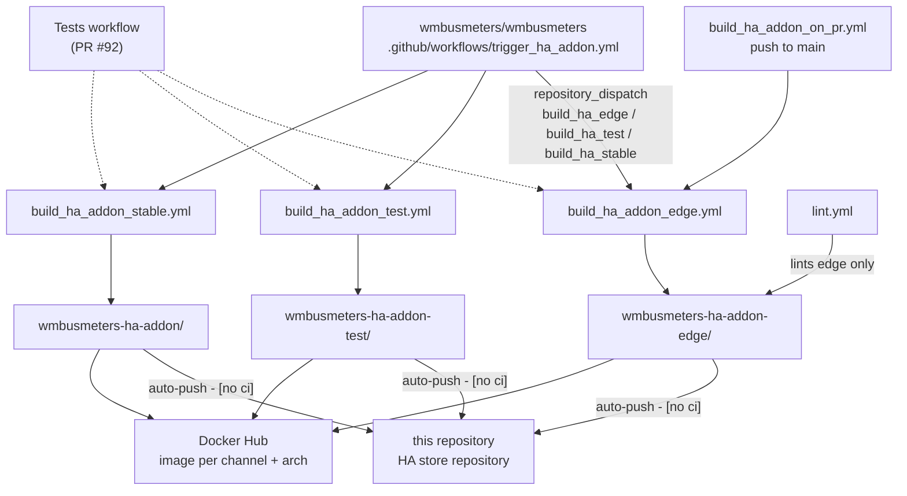

# Channel architecture

Three sibling add-on directories, their workflows and publish targets,
decision 0002.

The supervisor clones the store repository anonymously; for all three
channels that repository is this one (decision 0002).