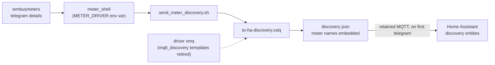

# Discovery pipeline

MQTT discovery generated from the driver sources, decision 0004.

The generator is driver driven: no per-driver json is maintained any
more. Status flag shaping is being negotiated in wmbusmeters#2092;
the former standalone discussion was issue/PR #927.