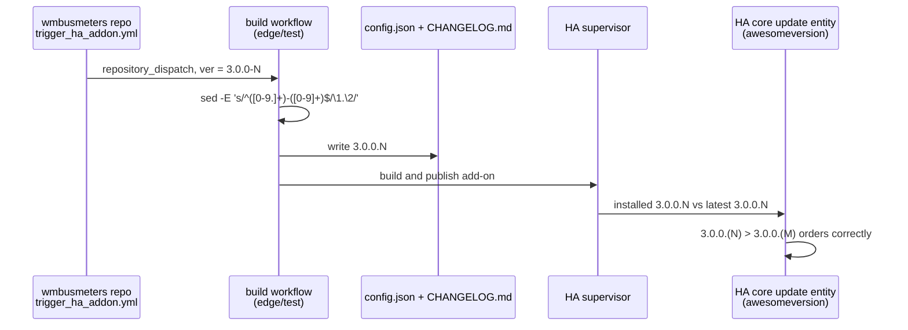

# Version lifecycle

From the upstream tag to the ordered version inside Home Assistant,
decision 0003.

Continuous edge builds increment the dotted number on every push to
`main` (`build_ha_addon_on_pr.yml`). Exact tags such as `3.0.0-RC1` are
passed through unchanged. The auto-push commit message keeps the raw
dispatched version; only `config.json` and `CHANGELOG.md` carry the
normalized form. Legacy `3.0.0-N` installs migrate because the first
dotted version orders above every legacy form.